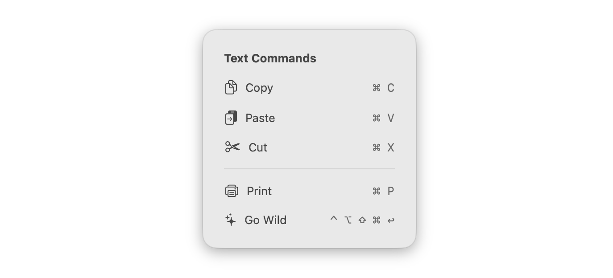

# CheatSheetOverlay
Customizable keyboard shortcut cheat sheet overlay for SwiftUI\


## Requirements
CheatSheetOverlay requires macOS 13.0 or later.

## Installation
CheatSheetOverlay can be added to a project as a Swift package.
```swift
.package(url: "https://github.com/ryanslikesocool/CheatSheetOverlay", from: "0.2.0"),
```

## Usage

Use `Label` to create an item in the cheat sheet.
```swift
Label("Copy", systemImage: "doc.on.doc")
```

------

Add a `.keyboardShortcut()` modifier with the desired shortcut to a `Label` to make it appear in the cheat sheet.
```swift
Label("Copy", systemImage: "doc.on.doc")
	.keyboardShortcut("c")
```

------

Use `GroupBox` to group multiple `Label`s.
```swift
GroupBox("Text Commands") {
	Label("Copy", systemImage: "doc.on.doc")
		.keyboardShortcut("c")
	Label("Paste", systemImage: "arrow.right.doc.on.clipboard")
		.keyboardShortcut("v")
	Label("Cut", systemImage: "scissors")
		.keyboardShortcut("x")
}
```

------

The cheat sheet can be added to a view with the `.cheatSheet` view modifier.  It takes a view as a parameter.  CheatSheetOverlay will apply styles the provided views.
```swift
ContentView()
	.cheatSheet {
		GroupBox("Text Commands") {
			Label("Copy", systemImage: "doc.on.doc")
				.keyboardShortcut("c")
			Label("Paste", systemImage: "arrow.right.doc.on.clipboard")
				.keyboardShortcut("v")
			Label("Cut", systemImage: "scissors")
				.keyboardShortcut("x")
		}

		GroupBox {
			Label("Print", systemImage: "printer")
				.keyboardShortcut("p")
			Label("Go Wild", systemImage: "sparkles")
				.keyboardShortcut(.return, modifiers: [.control, .option, .shift, .command])
		}
	}
```

------

The delay between when the activation key is held and when the cheat sheet appears can be changed by setting the `revealDelay` parameter on the `cheatSheet` modifier.\
This value is set to `0.75` by default.
```swift
ContentView()
	.cheatSheet(revealDelay: 0.75) { /* ... */ }
```

------

The activation key that must be pressed for the cheat sheet to appear can be changed by setting the `activationKey` parameter on the `cheatSheet` modifier.  This can be set to a single value or a combination of values.\
This value is set to `.command` (the ⌘ key) by default.
```swift
ContentView()
	.cheatSheet(activationKey: .command) { /* ... */ }
```
